<div align="center">



<br><br>


</div>

<br>

```console
alexey@tisbi:~/dev$ cat profile.toml
```
```toml
[identity]
name         = "Alexey"
role         = "Systems & Backend Engineer"
location     = "Kazan, RU"
since        = 15                      # возраст, в котором написал первую строку

[work]
current      = "Senior Backend Developer"
also         = "Sysadmin & Instructor @ TISBI College"
freelance    = "4 years"

[focus]
domains      = ["async runtimes", "p2p networking", "applied cryptography"]
principle    = "predictable, testable, production-grade"
```

<br>

```console
alexey@tisbi:~/dev$ rustc --version && echo $FAVOURITE_LANG
```
```
rustc 1.x.x — the language I actually think in

  ownership & borrowing ..... no GC, no data races, no surprises
  tokio ..................... thousands of concurrent tasks, one binary
  axum + sqlx ............... type-safe APIs down to the SQL row
  unsafe + ffi .............. when the abstraction has to end somewhere
```

<div align="center">
  
</div>

<br>

```console
alexey@tisbi:~/dev$ cat specialization.txt
```
```
L4  delivery     docker · nginx · ci/cd
L3  client       react/vite · tauri · avalonia
L2  service      axum · rest/ws · jwt/paseto · kafka
L1  data         postgresql · mysql · redis
L0  runtime      rust · tokio · linux
                 ^
                 this is where I actually live
```

I work the part of the stack most people never open: the runtime, the socket,
the byte on the wire. Not because it's fashionable — because that's where the
interesting failures are.

<br>

```console
alexey@tisbi:~/dev$ ls -la ./repos --sort=stars
```

| Repo | What it is | |
|---|---|---|
| **Unicron** | Multi-client ecosystem — desktop, mobile, web, server | [→](https://github.com/Logbin05/Unicron) |
| **CLI-Unicron-VPN-Proxy** | CLI tool with encrypted connection history and full path tracing | [→](https://github.com/Logbin05/CLI-Unicron-VPN-Proxy) |
| **ArchiveTool** | Archiver that builds self-extracting SFX bundles | [→](https://github.com/Logbin05/ArchiveTool) |
| **MeSync** | Telegram personal assistant bot | [→](https://github.com/Logbin05/MeSync) |
| **Union-Todo-android** | Todo app — Tauri + React + TypeScript | [→](https://github.com/Logbin05/Union-Todo-android) |
| **TaskBot** | Bot project, in progress | [→](https://github.com/Logbin05/TaskBot) |

**In progress:** `Aegis` — decentralized P2P messenger (libp2p · QUIC · Noise) · `VGP` — desktop proxy configuration manager

<br>

```console
alexey@tisbi:~/dev$ systemctl status teaching.service
```
```
● teaching.service — programming clubs @ TISBI College
     Loaded: loaded (/etc/tisbi/kruzhok.conf; enabled)
     Active: active (running)

   ├─ web-development ......... html/css → ts → react → next.js
   ├─ systems-programming ..... rust · cli tools · servers · drivers
   ├─ web-design .............. figma · ui/ux · typography · grids
   └─ mobile-development ...... react native · device apis · release

   Format: 2h/week · 32 sessions/year · every student ships a real project
```

I graduated from this college with honours, then came back to teach in it.
Four directions, from absolute zero to something you can actually put in a
portfolio — because nobody handed me that when I started.

<br>

```console
alexey@tisbi:~/dev$ ./what-makes-me-different.sh
```
```
[✓] senior engineer at 21 — shipping production Rust, not tutorials
[✓] red diploma, then hired back by the same college I studied at
[✓] I build the whole path: runtime → api → client → deploy
[✓] 4 years freelance — I know what breaks when a real client is waiting
[✓] I teach what I ship, and I ship what I teach
[✓] every project here started as "I needed this and it didn't exist"
```

<br>

<div align="center">


</div>

<br>

```console
alexey@tisbi:~/dev$ contact --list
```
```
  github     github.com/Logbin05
  telegram   @Logbin03
  status     open to interesting problems
```

<div align="center">
<br>
<sub>01001111 01001110 01001100 01001001 01001110 01000101</sub>
</div>
