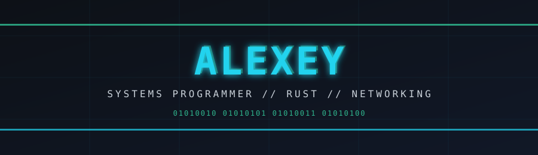

<div align="center">



<br><br>

<p>
  <a href="#-projects"></a>
  <a href="https://github.com/Logbin05"></a>
  <a href="#-contact"></a>
</p>

<p>
  
  
  
</p>

</div>

<br>

## // About

- Backend engineer working close to the runtime — Rust, async, low-level networking
- Building **Aegis**, a decentralized P2P messenger (libp2p, QUIC, Noise)
- Building **VGP**, a desktop tool for managing proxy server configurations
- Focused on predictable, testable, production-grade architecture

<br>

## // Highlights

<table>
<tr>
<td width="33%" valign="top">

**⚙ Zero-cost abstractions**
Rust ownership model — performance without a garbage collector

</td>
<td width="33%" valign="top">

**🔐 Applied cryptography**
Noise protocol, E2E encryption, PASETO auth

</td>
<td width="33%" valign="top">

**🌐 Decentralized by design**
P2P architecture, no single point of failure

</td>
</tr>
<tr>
<td width="33%" valign="top">

**⚡ Async at the core**
Tokio runtime, concurrent by default

</td>
<td width="33%" valign="top">

**🧩 Type-safe everywhere**
Strong contracts across the whole stack

</td>
<td width="33%" valign="top">

**🖥 True cross-platform**
Web + desktop via Tauri, single codebase

</td>
</tr>
</table>

<br>

## // Stack

<div align="center">
  
</div>

<br>

## // Architecture

```
L4  delivery     docker · nginx · ci/cd
L3  client       react/vite · avalonia+reactiveui · tauri
L2  service      axum · rest/ws · jwt/paseto · kafka
L1  data         postgresql · mysql · mssql · redis
L0  runtime      rust · tokio · linux
```

<br>

## // Projects

| Project | Description | Repo |
|---|---|---|
| **Unicron** | Multi-client ecosystem — Desktop / Mobile / Web / Server | [→](https://github.com/Logbin05/Unicron) |
| **MeSync** | Telegram personal assistant bot | [→](https://github.com/Logbin05/MeSync) |
| **CLI-Unicron-VPN-Proxy** | CLI tool, encrypted connection history, full path tracing | [→](https://github.com/Logbin05/CLI-Unicron-VPN-Proxy) |
| **ArchiveTool** | Archiving tool, builds self-extracting SFX | [→](https://github.com/Logbin05/ArchiveTool) |
| **Union-Todo-android** | Todo app — Tauri + React + TypeScript | [→](https://github.com/Logbin05/Union-Todo-android) |
| **TaskBot** | Bot project, in progress | [→](https://github.com/Logbin05/TaskBot) |

<br>

## // Metrics

<div align="center">
  
  
</div>

<div align="center">
  
  
</div>

<br>

## // Repositories

<div align="center">
  
  
</div>

<div align="center">
  
  
</div>

<div align="center">
  
  
</div>

<br>

## // Contact

<div align="center">

[GitHub](https://github.com/Logbin05)

<sub>01001111 01001110 01001100 01001001 01001110 01000101</sub>

</div>
